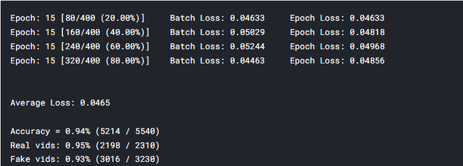

# Deepfake Detection
By: Robert Smithers, Sam Forbush, and Kalel Abdulaziz

This project aims to build a neural network that accurately classifies video as REAL or FAKE. The data is used from Kaggle and the competition can be found at the following link: [Deepfake Detection Challenge](https://www.kaggle.com/c/deepfake-detection-challenge)

## Table of Contents
**[Data](#data)**  
**[Augmentation](#augmentation)**  
**[Architecture](#architecture)**  
**[Results](#results)**  
**[Future Improvement](#future-improvement)**  
**[Contributions](#contributions)**  

### Data
All data consists of 10 second long videos which either are or are not a deepfake. There are approximately 10 unique faces used in the 400 train samples and 10 unique faces (different than in train) used in the test samples.

For our neural network, we grab a specified number of frames from each video to feed in as input. By default, I have it set to 5.

### Augmentation
Data was augmented using various random horizontal/vertical flips, rotations, scaling, as well as translations.

### Architecture
 A pretrained ResNet32 model handled all classification. To cater our data to fit our model, we crop the image to a set 150x150 size. Additionally, for increased results, we used a prebuilt face-detection library to remove extraneous details from our data and simplifying our task, allowing our model to be more effective.

### Results
Our model performed with 94% accuracy after 15 epochs.

### Future Improvement
To list a couple of possible areas to look into to further improve this model:
- More data (Generate more data by feeding in more frames from each video). Instead of 5, maybe 10 would work well, since 1 frame every second is plenty of time for frames to look different
- Facial recognition. Our current facial recognition library cuts out all data surrounding the head and turns it black. This may help the model remove any extraneous data, but it also loses some important telltale identifications of deepfakes, notably blurriness around the edges of the face. So, by not blacking out the area surrounding the face, the model could perhaps have another feature space to look at.
- Better evenness in the data. Our data is currently split at 41/59% real/fake. The dataset itself if around 30/70% real/fake, but we generated some extra data for the real videos. This would be worthwhile to further even it out at 50/50. Although, I will say that in our results, we did not see fake samples being detected at a significantly higher accuracy than real samples (after balancing to 41/59%).

### Contributions

Since we used the Kaggle dataset, our code had to be completed in full from a singular Jupyter Notebook. For this reason, we were unable to separate files and thus had to all collaborate on one file. The breakdown is listed here:

**Robert**
- Accessing and organizing Kaggle data (and sadly, the labels separately)
- Separating data into train/test splits
- Creating an easy to use/modify method of turning videos into a number of frames for data expansion (helps with balancing data, which Sam focused on) 
- Augmenting the data via transformations
- Researching, taking snippets, and playing around with the model (Resnet FTW!)
- Doing a bit of "brain-surgery" analysis on our trained model
- DataLoading
- Creating train + test functions
- Saving/Loading the model

**Sam**
- Modified number of frames per video based on label type (balancing data)
- Augmenting the data via transformations

**Kalel**
- Finding and using a library to detect individual faces